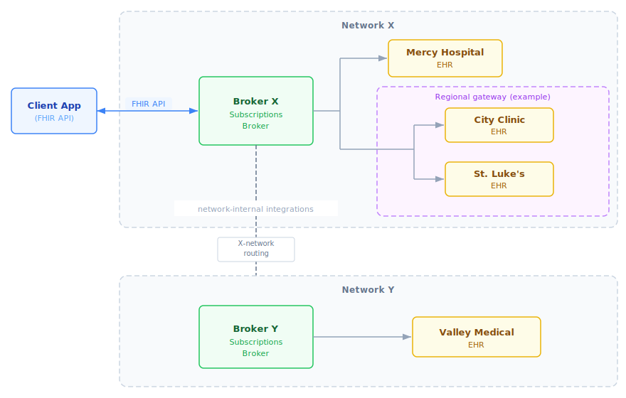

# CMS Aligned Networks: FHIR Subscriptions Broker Architecture

**CMS Interoperability Framework — Subscriptions Workgroup**

*Draft for Discussion*

---

## Vision 

The [CMS Interoperability Framework](https://www.cms.gov/priorities/key-initiatives/interoperability) requires that CMS-Aligned Networks deliver appointment and encounter notifications for outpatient, telehealth, ED, and inpatient encounters using FHIR Subscriptions by July 4, 2026.


## 1. The Problem

Without a brokered approach, an application would need to subscribe for events directly at every data source where a patient might receive care. This is a nonstarter: you can never know in advance every site where a patient might show up — an ED visit, a new specialist, an urgent care clinic while traveling. Even setting aside this fundamental problem, the infrastructure doesn't exist:

- Where FHIR APIs exist, they require provider-portal-specific registration, credentials, and approvals — and rarely support Subscriptions
- Notification capabilities, where they exist, vary widely (HL7v2 ADT, proprietary feeds, polling)

The brokered model solves both problems: the app doesn't need to know where a patient will be seen, and it doesn't need to integrate with each site's technology. The network handles discovery and event routing.

## 2. The Brokered Model

A **Subscriptions Broker** operated by a CMS-Aligned Network solves this by giving applications a single FHIR API surface with network-wide reach:

1. **One connection** — The app creates a subscription at the Broker, not at individual data sources
2. **Network-wide notifications** — The Broker arranges to receive events from all participating data sources and peer networks, then delivers them as standard FHIR notifications
3. **Internal plumbing is invisible** — The Broker handles whatever integration is needed behind the scenes


### 2.1 What the Broker Abstracts Away

The Client sees a standard FHIR Subscriptions API. Behind it, the Broker may:

- Create FHIR Subscriptions at Data Sources that support them natively
- Configure HL7v2 ADT routing from Data Sources that use ADT feeds
- Poll Data Sources that don't support push
- Query a Record Locator Service (RLS) to discover relevant Data Sources
- Register for events from peer CMS-Aligned Networks (see [Cross-Network Peering](peering.md))
- Convert events from HL7v2, CCDA, or proprietary formats into FHIR notifications

None of this is visible to the Client. The Client creates a FHIR Subscription, receives FHIR notification bundles, and retrieves FHIR resources.

*Implementation note:* The Broker a Client connects to is a logical service endpoint, not necessarily a single monolithic system. Large networks may operate a **federated or hierarchical broker topology** internally (e.g., national → regional → local), and some Data Sources may connect through intermediaries while others connect directly. This is a network implementation choice — the Client sees a single FHIR API regardless.

### 2.2 Terminology

- **Network (CMS-Aligned Network):** An administrative trust domain that offers a unified Client-facing API surface (e.g., record location and subscription services) under a common participation agreement. A Network may be implemented as a federation or hierarchy of sub-networks and intermediaries.
- **Trust framework:** A set of shared legal, policy, and technical rules that allows multiple Networks to interoperate (e.g., via cross-network query and/or notification routing). A trust framework may support bilateral or multilateral interoperability arrangements.

### 2.3 Roles

| Actor | Description |
|-------|-------------|
| **Client** | Application that creates subscriptions and receives notifications (patient-facing IAS apps, provider apps, care management platforms) |
| **Broker** | CMS-Aligned Network component that manages subscriptions, aggregates events, and delivers notifications. The Broker is a logical Client-facing service endpoint and may be implemented as a federated topology internally. |
| **Data Source** | System that holds patient data and produces events (provider EHRs, payers) |

### 2.4 Relationship to Other Specifications

| Specification | Relationship |
|---------------|--------------|
| [US Core Patient Data Feed](http://hl7.org/fhir/us/core/patient-data-feed.html) | This architecture uses the Patient Data Feed topic and extends it for brokered scenarios |
| [FHIR R4 Subscriptions Backport](http://hl7.org/fhir/uv/subscriptions-backport/) | Subscription resource structure and notification bundle format |
| [SMART Backend Services](http://hl7.org/fhir/smart-app-launch/backend-services.html) | Basis for B2B authorization pattern |

### 2.4 Appointment Notifications

To keep the client-facing contract simple and compatible with existing profiles, appointment notifications are represented as **planned Encounters** conformant to the **US Core Encounter** profile: an appointment is a future-dated Encounter (e.g., `status="planned"` with `period.start` in the future). Networks may map from scheduling systems internally; Clients consume standard US Core Encounter resources.

### 2.5 Trust and Privacy Model

The Broker operates within the same network trust framework that CMS-Aligned Networks already use for services like Record Locator Services — it does not expand the categories of PHI the network handles or the legal basis under which it operates. See the [FAQ](faq.md) for details on trust, patient matching, and notification privacy.

---

## 3. Patient Identity in the Brokered Model

Patients do not have a single stable identifier across organizations or networks. The brokered model does not require one.

Instead:

1. The Client presents **IAL2-verified identity attributes** (e.g., demographic data from a trusted identity provider like CLEAR or ID.me) when requesting an access token from the Broker
2. The Broker returns a **broker-scoped `Patient.id`** in the access token response (using the SMART on FHIR `patient` parameter)
3. The Client uses this `Patient.id` in subscription filter criteria

This `Patient.id` is meaningful only at the Broker — it is not a cross-organization identifier. How the Broker resolves identity — including when and how patient matching occurs for incoming events — is a network-internal concern (see [FAQ](faq.md#what-about-patient-matching-ehrs-manage-their-own-matching-thresholds-today) for discussion of matching approaches). The Client never needs to know how patients are identified at individual Data Sources.

---

## 4. Authorization

### 4.1 Identity Requirements

Per CMS Framework Criteria V, all access requires IAL2/AAL2-verified identity. The Client coordinates identity proofing through a [Kantara-certified](https://kantarainitiative.org/trust-status-list/) identity service at IAL2 (e.g., CLEAR, ID.me) out-of-band, then presents the resulting credentials when requesting access tokens.

### 4.2 Authorization Context

Access tokens are obtained in the context of verified:

1. **Who** — The verified identity (patient, provider, or delegate)
2. **What** — The permitted scope of access
3. **Why** — The purpose (individual access, treatment, payment, operations)
4. **Consent** — Evidence that disclosure is authorized (see [Section 4.3](#43-consent-and-authorization-pilot-vs-at-scale) for how consent scope evolves from pilot to production)

The authorization flow follows a Backend Services-style pattern: the Client presents credentials in a token request and receives a token without user interaction — identity proofing and consent have already occurred out-of-band.

### 4.3 Consent and Authorization: Pilot vs. At Scale

For an **initial pilot**, implicit authorization may be sufficient — for example, assuming that a patient who has completed IAL2 identity proofing and installed an IAS app has consented to receive their own data.

This **will not scale** to scenarios that require explicit, granular consent:

- Designated representatives acting on behalf of a patient
- Caregivers with partial access rights
- Minors and guardians with age-dependent rules
- Substance use disorder or behavioral health data with 42 CFR Part 2 restrictions

These scenarios require a standardized mechanism for conveying consent context alongside identity in token requests. The community is exploring portable, cryptographically verifiable artifacts (e.g., "SMART Permission Tickets") that could encode identity, consent, and purpose of use in a way that propagates across components. These are **not required** for this architecture but may inform future production profiles. The CMS Patient Preferences and Consent Workgroup is also exploring how consent information should be conveyed in network transactions.

The specific format for authorization requests is **out of scope for this document** but must be pinned down for production use. See [FAQ](faq.md#why-is-implicit-consent-acceptable-for-a-pilot-but-not-at-scale) for further discussion.

### 4.4 Token Response

The Broker's token response follows [SMART on FHIR](http://hl7.org/fhir/smart-app-launch/) conventions, including a `patient` parameter that gives the Client the broker-scoped `Patient.id` to use in subsequent requests:

```js
{
  "access_token": "eyJ...",
  "token_type": "bearer",
  "expires_in": 3600,
  // Subscription management + Encounter read for proxy retrieval
  "scope": "system/Subscription.crud system/Encounter.r",
  "patient": "broker-123"  // Broker-scoped Patient.id for use in filters
}
```

The Client uses this `patient` value when constructing subscription filter criteria — it never needs to know or supply a cross-organization patient identifier.

---

## 5. Protocol Flow


### 5.1 Creating a Subscription

**Client → Broker**

```http
POST https://broker.example.org/fhir/Subscription
Authorization: Bearer {access_token}
Content-Type: application/fhir+json
```

```js
{
  "resourceType": "Subscription",
  "status": "requested",
  "reason": "Monitor patient encounters across network",

  // Topic: US Core Patient Data Feed
  "criteria": "http://hl7.org/fhir/us/core/SubscriptionTopic/patient-data-feed",
  "_criteria": {
    "extension": [{
      "url": "http://hl7.org/fhir/uv/subscriptions-backport/StructureDefinition/backport-filter-criteria",
      // Filter to encounters for this patient (broker-scoped id from token response)
      "valueString": "Encounter?patient=Patient/broker-123&trigger=feed-event"
    }]
  },

  "channel": {
    "type": "rest-hook",
    // Where the Broker should POST notifications
    "endpoint": "https://client.example.org/fhir/notifications",
    "payload": "application/fhir+json",

    // Optional but recommended: shared secret header for validation
    "header": [
      "X-Subscription-Token: {shared_secret}"
    ],

    "_payload": {
      "extension": [{
        "url": "http://hl7.org/fhir/uv/subscriptions-backport/StructureDefinition/backport-payload-content",
        // Notification includes references only — Client fetches full resources separately
        "valueCode": "id-only"
      }]
    }
  }
}
```

**Key points:**

- `patient=Patient/broker-123` uses the **broker-assigned `Patient.id`** from the token response — not a cross-organization identifier
- The `trigger=feed-event` filter uses the US Core Patient Data Feed topic's trigger definition
- `id-only` payload means notifications contain references, not inline resources (see [FAQ](faq.md#do-notifications-reveal-phi) on PHI implications)

**Security requirements:**

- For `rest-hook` delivery, the Broker **SHALL** require an `https://` endpoint and **SHALL NOT** deliver notifications to `http://` endpoints.
- The Client **MAY** include one or more HTTP headers using `Subscription.channel.header`. If present, the Broker **SHALL** include these headers in every notification request.
- If the Client uses a shared secret header (recommended), it **SHOULD** be unpredictable (e.g., a UUID or 32-character hex string) and the Client **SHOULD** reject notifications that do not present the expected value.

### 5.2 Broker Processes the Subscription (Internal)

What happens inside the network is opaque to the Client. The Broker arranges to receive relevant events from Data Sources using whatever mechanisms are available — FHIR Subscriptions, HL7v2 ADT feeds, polling, peer network queries. The Client sees only the `Subscription` resource (with status updates) and the notifications that follow.

| Status | Meaning |
|--------|---------|
| `requested` | Client has requested; Broker is setting up |
| `active` | Subscription is live; notifications will be delivered |
| `error` | Problem occurred (details in `error` element) |
| `off` | Subscription is disabled |

### 5.3 Event Occurs and Notification Is Delivered

**Broker → Client**

When a matching event occurs at any Data Source in the network (or a peer network), the Broker delivers a FHIR notification bundle:


The Broker delivers the notification over HTTPS, including any headers the Client specified:

```http
POST https://client.example.org/fhir/notifications
Content-Type: application/fhir+json
X-Subscription-Token: {shared_secret}
```

```js
{
  "resourceType": "Bundle",
  "type": "subscription-notification",
  "timestamp": "2026-03-15T14:32:00Z",
  "entry": [{
    "fullUrl": "urn:uuid:notification-status-1",
    "resource": {
      "resourceType": "SubscriptionStatus",
      "status": "active",
      "type": "event-notification",
      "eventsSinceSubscriptionStart": 1,
      "notificationEvent": [{
        "eventNumber": 1,
        "timestamp": "2026-03-15T14:30:15Z",
        "focus": {
          // Baseline: Broker Proxy Retrieval mode
          // (avoids per-provider client registrations during initial deployments)
          "reference": "https://broker.example.org/fhir/Encounter/enc-98765",
          "type": "Encounter"
        }
      }],
      // Points back to the Broker where the Client created the Subscription
      "subscription": {
        "reference": "https://broker.example.org/fhir/Subscription/sub-abc123"
      },
      "topic": "http://hl7.org/fhir/us/core/SubscriptionTopic/patient-data-feed"
    }
  }]
}
```

**Key points:**

- `focus.reference` is an **absolute URL** — the Client follows it to retrieve the resource.
- In the baseline deployment model, `focus.reference` **points to the Broker** (proxy/cached retrieval).
- A Broker **MAY** return `focus.reference` values that point to Data Sources when network-wide client registration is feasible (see Section 5.4).
- `subscription.reference` points to the Broker (where the Client created it)
- `eventNumber` allows the Client to detect missed notifications (see [FAQ](faq.md#what-happens-if-the-client-misses-a-notification))

### 5.3.1 Delivery Semantics and Catch-up

Notification delivery is **best effort**: transient network failures, client downtime, and duplicate deliveries can occur. Clients **MUST** be idempotent and treat notifications as **at-least-once** delivery.

Each `subscription-notification` includes a monotonically increasing `eventNumber`. Clients **SHOULD** detect gaps and call the Subscription `$events` operation to catch up. Clients **SHOULD** also poll `$events` on startup/resume and periodically (on the order of **weekly**) even when no gaps are detected. Brokers **SHOULD** retain events for catch-up for at least **14 days**.

### 5.4 Client Retrieves Data

This specification supports two data retrieval modes. **Proxy Retrieval Mode is the baseline expectation for initial deployments**, since provider-by-provider client registrations are operationally unworkable at national scale.

**Proxy Retrieval Mode (baseline):**

- The Broker **SHALL** use `focus.reference` URLs rooted at the Broker.
- The Client retrieves the resource from the Broker using its existing Broker-issued access token.

**Direct Retrieval Mode:**

- The Broker **MAY** use `focus.reference` URLs rooted at a Data Source.
- This mode requires that the network provide **a pathway for automated client registration** across all participating Data Sources (e.g., SMART/UDAP dynamic registration, or a single network-level registration ceremony accepted by all providers).

| `focus.reference` URL Base | Meaning | Client Action |
|----------------------------|---------|---------------|
| Broker's endpoint | Proxy Retrieval Mode | Fetch from Broker (already authenticated) |
| Data Source endpoint | Direct Retrieval Mode | Discover auth + obtain token + fetch from Data Source |

- Conformant Clients **MUST** support Proxy Retrieval Mode.
- Clients **SHOULD** also support Direct Retrieval Mode so they can interoperate with networks that provide automated registration pathways.

### 5.5 Summary: What's Specified vs. Internal

| Step | Specified or Internal | Notes |
|------|----------------------|-------|
| Token request to Broker | **Specified** (format TBD) | Backend Services-style with identity + consent |
| Subscription creation | **Specified** | FHIR Subscription resource |
| Broker arranges event feeds | **Internal** | Network-specific (FHIR, HL7v2, polling, etc.) |
| Data Source event production | **Internal** | ADT, FHIR, or other |
| Notification delivery | **Specified** | FHIR subscription-notification Bundle |
| Token request to Data Source | **Specified** | Only in Direct Retrieval Mode |
| Data retrieval | **Specified** | FHIR RESTful read (typically from Broker in baseline mode) |

---

## 6. Open Questions

1. **Authorization and consent mechanisms:** How does a Client present identity and consent credentials in a token request — and how does this context propagate to Data Sources? Implicit consent may suffice for initial pilots but will not scale to designated representatives, partial access rights, or sensitive data categories. The SMART Permission Tickets initiative and CMS Patient Preferences and Consent Workgroup are exploring standardized approaches.

2. **Cross-network peering:** When a subscription at one Broker needs to trigger notifications from Data Sources in other networks, how do subscription filters and patient identity information propagate between Brokers? This is analogous to cross-network patient discovery for queries, but applied to event-driven subscriptions. See [Cross-Network Peering](peering.md) for an experimental sketch of approaches.

---

## References

- [CMS Interoperability Framework](https://www.cms.gov/priorities/key-initiatives/interoperability)
- [US Core Patient Data Feed](http://hl7.org/fhir/us/core/patient-data-feed.html)
- [FHIR R4 Subscriptions Backport IG](http://hl7.org/fhir/uv/subscriptions-backport/)
- [SMART Backend Services](http://hl7.org/fhir/smart-app-launch/backend-services.html)
- [SMART on FHIR](http://hl7.org/fhir/smart-app-launch/)
- [Kantara Trust Status List](https://kantarainitiative.org/trust-status-list/)
